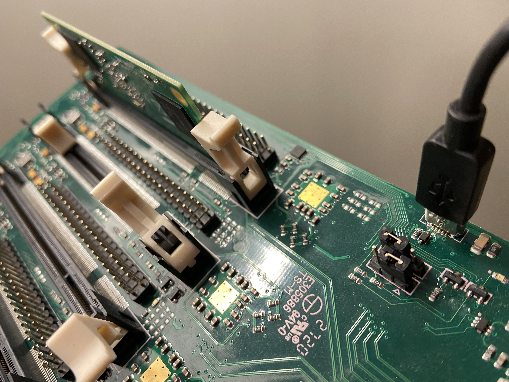

# Flashing compute modules

You can flash compute modules using the Turing Pi board. Please follow the steps below to do this:

## 1. flashing node, port, and flash mode

You can flash the compute module using the top/main node on the board. Switch the jumper into the flash mode before flashing and plug your computer into the micro USB flashing port. 



## 2. Install the `usbboot` tool

To turn the Raspberry Pi device into a USB Mass Storage Device, you need the [`usbboot`](https://github.com/raspberrypi/usbboot) tool developed by the Raspberry Pi foundation.

Before you use usbboot tool, you need to install a `libusb` dependency. The easiest way to install it is by using [Homebrew](https://brew.sh/):

```text
brew install libusb
```

Now you can install `usbboot` by cloning it's repository and running `make`:

```text
# Clone the `usbboot` repository.
git clone --depth=1 https://github.com/raspberrypi/usbboot
cd usbboot
make
```

If you get a [deprecation warning](https://github.com/raspberrypi/usbboot/issues/53), please ignore it. 

Run rpiboot with sudo:

```text
sudo ./rpiboot
```

Connect the Turing Pi to your computer via a micro USB flashing port, and power on the board. You should see the following:

```text
sudo ./rpiboot
Password:
Waiting for BCM2835/6/7/2711...
Sending bootcode.bin
Successful read 4 bytes 
Waiting for BCM2835/6/7/2711...
Second stage boot server
File read: start.elf
Second stage boot server done
```


If your computer doesn't see the compute module, or you getting errors when trying to write an OS on it, please try other USB cables. Some USB cables may not supply enough power to transfer data onto USB mass storage devices. Also, always plug a USB cable directly into your computer. 


Once that's complete, you may see a message stating "The disk you inserted was not readable by this computer.". Simply click "Ignore".


## 3. Flash OS


We recommend using [Hypriot OS](https://blog.hypriot.com/downloads/) and setup each node with SSH enabled Docker container, instead of connecting a keyboard and a mouse to USB ports.


1. Find out the identifier of the Compute Module: `diskutil list` \(should be an 'external, physical' ~8/16/32 GB device, like `/dev/disk2`\)
2. Unmount the disk: `diskutil unmountDisk /dev/disk2` \(substitute your disk identifier here!\)
3. Write the OS image to the card:

```text
pv ~/Downloads/hypriotos-rpi-v1.12.3.img | sudo dd bs=1m of=/dev/rdisk2
```

This command uses `pv` \(`brew install pv`\) which makes it easy to monitor the progress. You can use `dd`instead.

## 4. Boot the compute module

After unmounting the volume:

1. Unplug the power and micro USB connection
2. Switched the jumper back to 'boot' mode
3. Power the Turing Pi board

