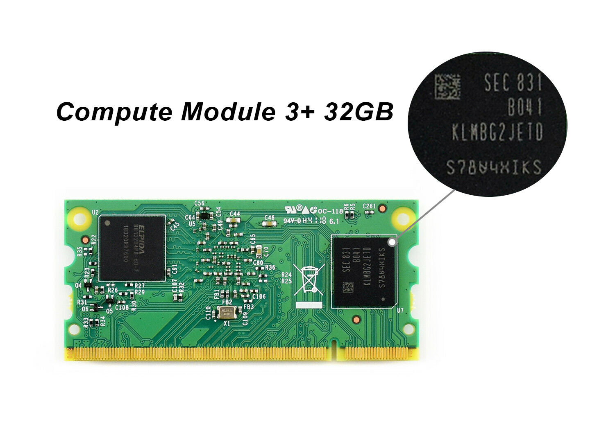

# Supported compute modules

The Turing Pi V1 board wors with Raspberry Pi compute modules 1, 3, 3+. 

You can use Compute Modules with or without onboard eMMC memory. If you have compute modules without eMMC storage, you can use a microSD card. For a better experience, we recommend using compute modules with eMMC storage. 


Please note, you can use either eMMC or SD card storage. You can't use both options. 


