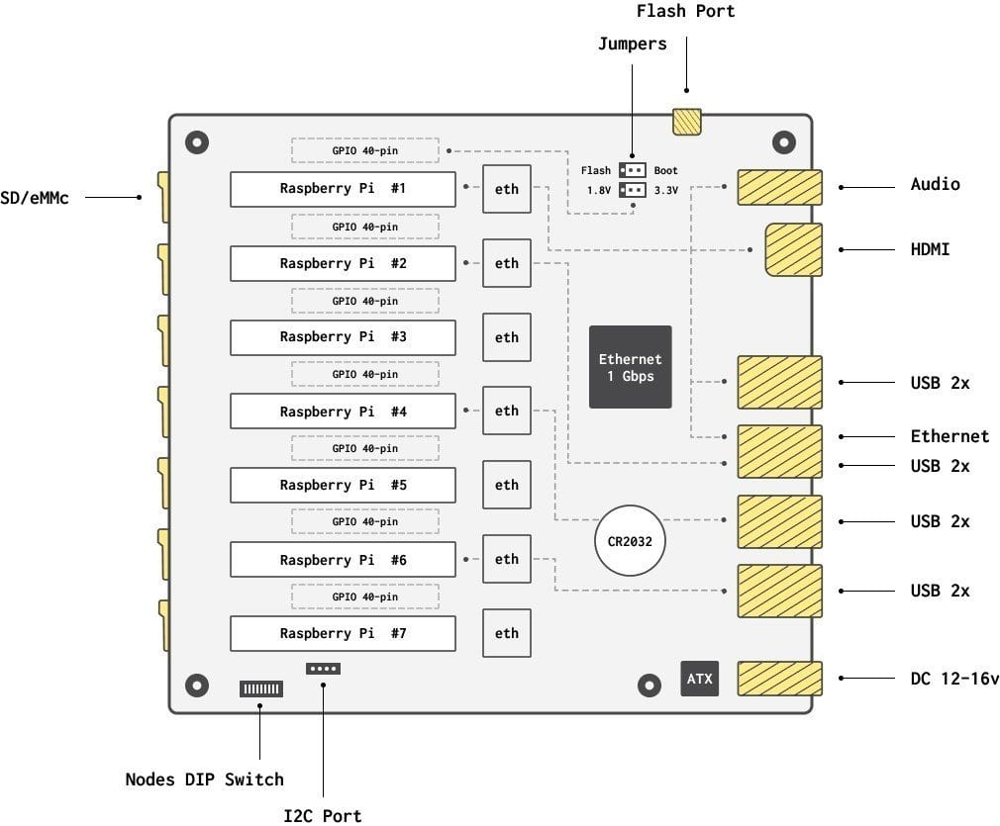

# Specs

## Scheme 

## Overview 

| Name | Value |
| :--- | :--- |
| Supported Compute Modules | Raspberry Pi Compute Module 1, 3, 3+ |
| CPU cores, Max. | 28 |
| RAM, Max. | 7GB |
| Internal eMMC, Max. | 224GB |
| Boot from the network \(netboot\) | Yes, tested with CM3, CM3+, and Hypriot OS v1.11.3 |
| Boot from eMMC | Yes |
| Boot from SD | Yes |
| Compute Modules, Max. QTY | 7x, DDR2 SO-DIMM 200 pin |
| Micro SD slots, QTY | 7x, 1 per node |
| Ethernet Port | 1x, 1Gbps |
| Int. Network Speed, Max. | 1Gbps |
| Node Network Speed | 100Mbps per node |
| Power supply |  12V, 5A, 60 W, 2.1-5.5mm \(center positive\) |
| Power consumption, Max. | 40 W |
| Board form factor | Mini ITX, 6.7 x 6.7 inches \(170 x 170 mm\) |
| Mini ITX Power socket 2x2 pin | 12 V |
| Flash port | Only for Master Node via micro USB |
| GPIO 40-pin, RPI compatible pinout | 7x \([Standard Raspberry Pi 3 pinouts](https://www.raspberrypi.org/documentation/usage/gpio/)\) |
| HDMI | 1x, Node \#1 \(Master Node\) |
| Audio 3.5 mm | 1x, Node \#1 \(Master Node\) |
| USB 2.0 | 8x |
| RTC battery | CR2032 |

## Cluster Management Bus \(CMB\) 

| Name | Value |
| :--- | :--- |
| CMB protocol | I2C |
| CMB access | From each node |
| Node Power Management | Yes, via CMB for each node |
| Userspace EEPROM | 128bytes |
| Int. CMB devices | Ethernet Switch, I2C expander, and RTCC |
| External I2C ports | 1x, for additional devices like LCD displays or EEPROM |

## Block Scheme 

## Reference Links 

* [Cluster Management Bus](https://docs.turingpi.com/turing_pi/children/i2c_cluster_bus/)

